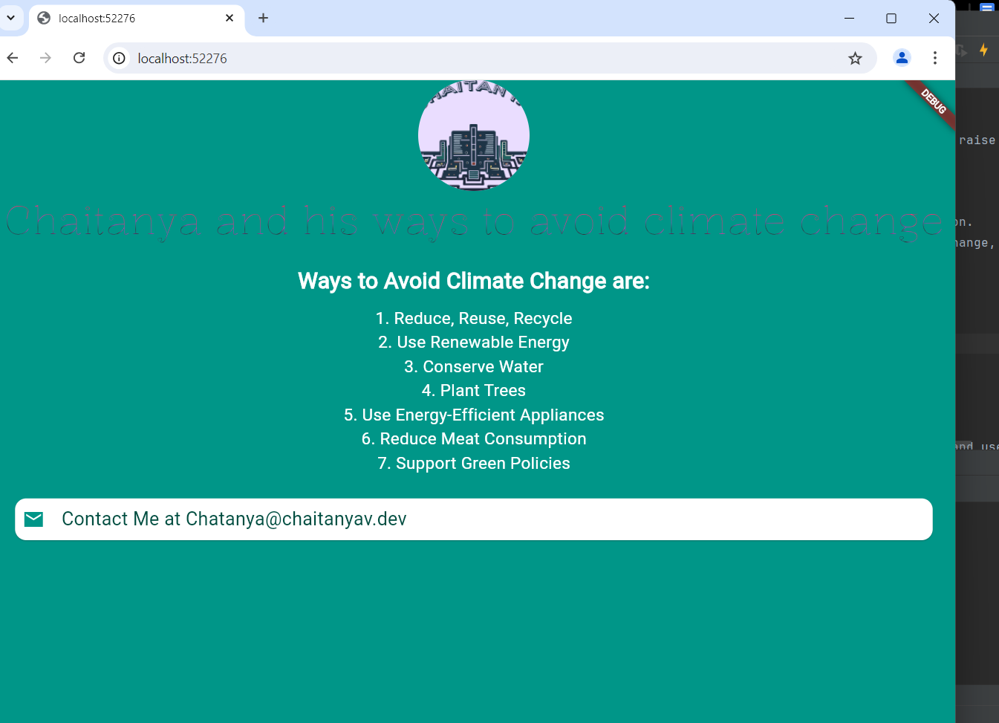

# Chaitanya's Climate Change Awareness App

This Flutter application is a personal project by Chaitanya, designed to raise awareness about climate change and some tips

## Screenshot(see what i did there cuz one so not screenshots)

##Contributing
If you'd like to contribute to this project, please fork the repository and use a feature branch. Pull requests are warmly welcome.

##Contact
You can reach out to me at Chaitanya@chaitanyav.dev for any questions or feedback.

##License
This project is licensed under the MIT License 

